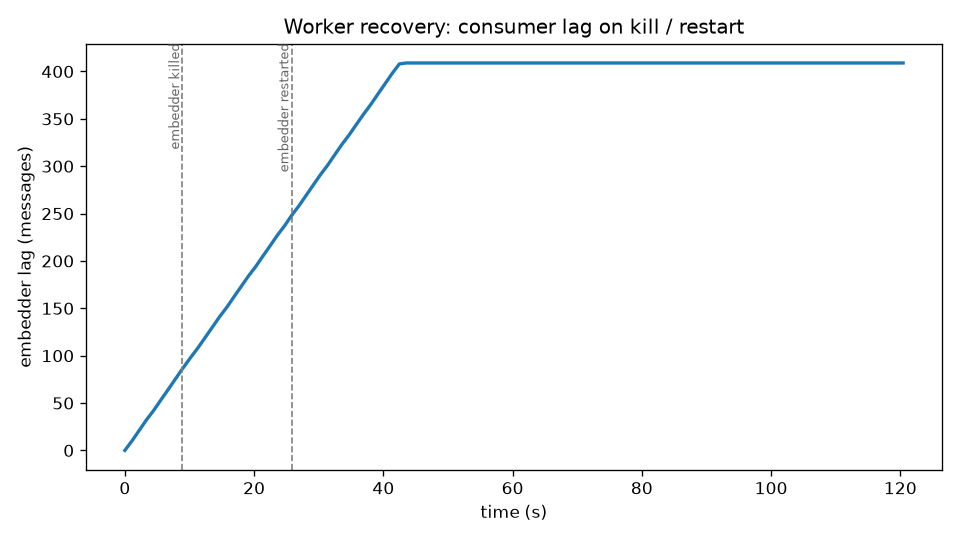
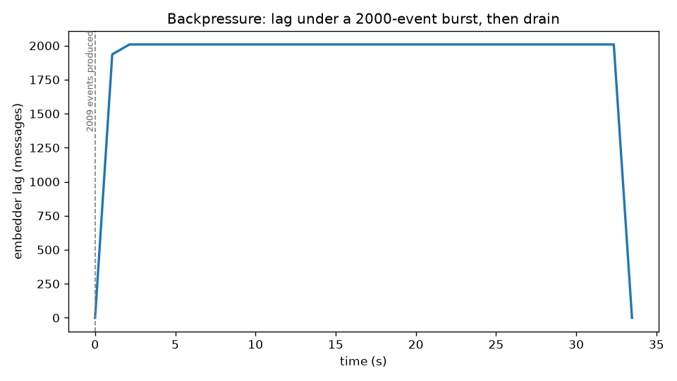

# Failure drills

Resilience claims, demonstrated rather than asserted. Each drill drives the real
stack, samples a metric over time, and checks a property. Run them all with:

    make up
    pip install -e ".[embed]" -e ".[eval]"
    make drills

The graphs below are committed PNGs produced by the drill harness
(`freshet/eval/drills.py`); the **same signals are visible live** on the Grafana
dashboard (`make up-obs` then http://localhost:3000/d/freshet-pipeline). The drills
are timing-sensitive demonstrations, not CI tests: numbers vary run to run, the
properties don't. Figures below are from a representative run (2026-06-15,
single-node stack on a laptop, stub embedder).

## 1. Worker recovery: no data loss across a crash

**Claim.** If an embedding worker dies mid-stream, events queue in Kafka rather
than being lost; when the worker restarts it resumes from its committed offset
and drains the backlog, and every event is eventually indexed (at-least-once
delivery + idempotent upserts = effectively once).

**Drill.** Stream events continuously; kill the embedder ~8s in; restart it ~25s
in; sample the embedder's consumer lag throughout; assert the final indexed count
equals the produced count.

**Result.** `409 produced, 409 indexed, no loss.` Lag climbs while the embedder
is dead (events accumulating in `normalized.events`), then drains to zero after
restart.

## 2. Replay re-index: durable re-processing after a model change

**Claim.** Because Kafka retains the stream and the index keys each row
deterministically (`chk_<event_id>_<chunk>`), you can re-embed the entire corpus
after changing the embedding model by replaying the topic: rows are overwritten
in place, not duplicated. This is the durable-replay property the brief calls a
load-bearing reason for Kafka.

**Drill.** Index a corpus; record its row count and newest `indexed_at`; simulate
a model change by replaying `normalized.events` from the beginning under a fresh
consumer group (the same mechanism `make replay` exposes standalone); re-check.

**Result.** `109 rows re-indexed in place, indexed_at advanced.` The row count is
unchanged (no duplication) and every row's `indexed_at` moved forward (everything
was genuinely re-processed). No graph: the evidence is the before/after
invariant, reproducible on its own via `make replay`.

## 3. Burst backpressure: bounded lag, then drain

**Claim.** A sudden burst far larger than steady load does not lose data or wedge
the pipeline; consumer lag spikes and then drains as the embedder works through
the backlog (backpressure is absorbed by the broker, not dropped).

**Drill.** Produce a ~2000-event burst as fast as possible into 3-partition
topics; sample embedder lag until it returns to zero; assert no data loss.

**Result.** `peak lag 2009, drained to 0, 2009 indexed.` The whole burst backs up
in the broker, then the embedder catches up and the index reaches the full count.

---

These three are the resilience side of the project's thesis: streaming isn't just
fresher (see [`RESULTS.md`](RESULTS.md)), it's also durable under worker failure,
model changes, and load spikes, and you can watch each property happen.
