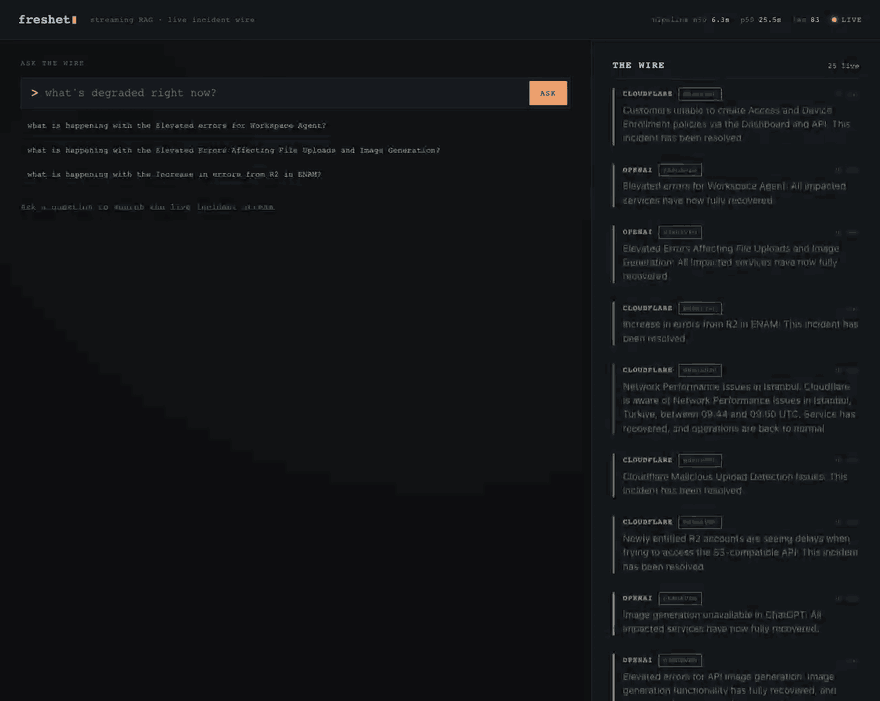
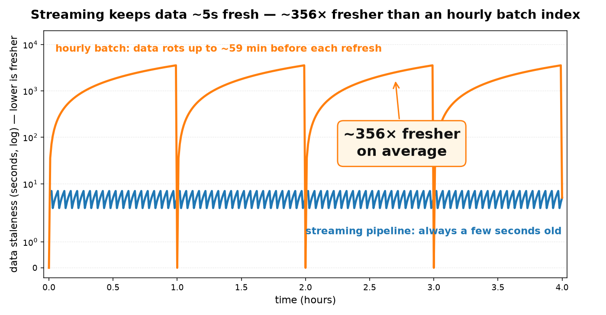

# Freshet: Real-Time Incident Intelligence

[](https://github.com/KrasiKirov/freshet/actions/workflows/ci.yml)

**Streaming RAG for on-call engineers.** Freshet ingests operational events
(deploys, alerts, metrics, incident chat, postmortems) through Kafka, indexes them
into pgvector within **seconds**, and answers *"what's breaking, and why?"* with
cited, recency-aware answers. It then autonomously briefs the incident and drafts
the postmortem.



*The live UI over **real** Cloudflare/GitHub/OpenAI/Discord/Reddit status incidents (`make up && make live-demo`). Every answer is grounded with `[source @ timestamp]` citations.*

### Why it's different: measured, not claimed

- **~356× fresher than a nightly-batch baseline** (5s vs 1778s mean data staleness):
  the comparison the system is built to make.
- **Hybrid retrieval: recall@5 0.81 / nDCG@5 0.63** on a 160-query benchmark: dense
  (`bge`) + lexical + RRF fusion + cross-encoder rerank + citation verification +
  abstention, beating vector-only (0.80) and keyword-only (0.62).
- **Autonomous incident loop**: on an alert it identifies the bad **commit**, pulls
  the runbook, estimates impact, posts a **cited Slack brief**, and threads a
  **postmortem** on resolution.
- **Validated on real data it didn't generate**: 225 real public-status-feed
  incidents, hand-labeled. Retrieval surfaces the cause-stating update in the top 5
  **92%** of the time, and the abstention floor tuned on synthetic data transfers to
  real language unchanged (`make real-eval`).
- **Rigorously evaluated, honestly**: retrieval, root-cause (hardened decoy
  benchmark), LLM-as-judge faithfulness, and a three-arm agentic ladder whose
  **ablation shows the LLM agency adds nothing** over a deterministic retrieval
  pipeline. Negative results are reported, not hidden.

### Run it in two commands (core path needs no API key)

    make up      # Redpanda + Postgres/pgvector, waits until healthy
    make demo    # ingest a scripted incident, then answer about it

## Live demo: real incidents, right now

`make up && make live-demo` polls **real public status feeds** (Cloudflare, GitHub,
OpenAI, Discord, Reddit), streams them through the full pipeline, and opens a UI at
`http://localhost:8000` where you can ask *"what's degraded right now?"* and get a
grounded, **cited** answer over live incidents, with a streaming feed showing each
incident's severity, status, and how many seconds ago it was ingested.

Honest notes: the data is **real** but the corpus is small (a few companies' recent
incidents); the demo runs the **full Kafka streaming stack locally**. `make live-demo`
loads `.env.local`, so with `ANTHROPIC_API_KEY` set the answers are **LLM-written,
grounded, and cited**; without a key it falls back to the keyless cited-template
composer (still grounded, just extractive).

Security posture: this is a **local dev stack, not a deployable service**. Every
listener binds loopback only (the compose ports are `127.0.0.1:`-prefixed; uvicorn
defaults to 127.0.0.1), Postgres runs with demo credentials, the broker is
unauthenticated PLAINTEXT, and the query API has **no auth or rate limiting**: with
a key set, each `/query` is LLM spend. Do not port-forward or rebind `:8000`/`:8088`
to a public interface; if you ever host it, put auth + rate limiting in front and set
`FRESHET_GITHUB_WEBHOOK_SECRET` so webhook deliveries are HMAC-verified.

### Autopilot (autonomous responder)

`make autopilot` runs a separate consumer that reacts to incident lifecycle
events on Kafka: when the normalizer opens a new incident, autopilot debounces
briefly, then investigates it (the tool-using agent with a key, the keyless
extractive timeline without one) and prints a **cited incident brief**: cause,
runbook, status. Each incident is briefed exactly once (a durable `briefed_at`
claim), so redelivery and restarts never double-post. On resolution it auto-posts a
threaded, cited **postmortem** (cause + fix + duration); Slack delivery and impact
estimation are covered below.
By default the brief prints to stdout. `make autopilot-slack` posts it to Slack
(`--sink slack`, needs `SLACK_BOT_TOKEN`/`SLACK_CHANNEL` in `.env.local` and
`pip install -e ".[slack]"`); `--sink slack-dry-run` renders the Slack payload
without posting.

**`make slack-demo`** drives one incident open → resolve through the pipeline
so the autopilot posts a **cited brief** and, on resolution, a **threaded
postmortem**: the whole loop in one command. It is **safe by default**: it renders
the Block Kit payload to your terminal and **posts nothing** (no token needed). To
post to a real workspace, set it up once (your Slack app, nothing committed):

1. Create a Slack app at <https://api.slack.com/apps>, choosing *From scratch*.
2. **OAuth & Permissions**: add the bot scope **`chat:write`**, then *Install to workspace*.
3. Invite the bot to a channel: `/invite @your-app`.
4. In `.env.local` (gitignored) set `SLACK_BOT_TOKEN=xoxb-...` and `SLACK_CHANNEL=#your-channel`,
   then `pip install -e ".[slack]"`.

Then `REAL=1 make slack-demo` posts the brief + threaded postmortem for real. (Threading
is exercised only on a real post; the dry-run renders both messages un-threaded, since no
Slack message timestamp comes back to thread under.)

Each brief/postmortem includes a derived **impact** line (Low/Medium/High from
breadth + duration + impact figures quoted in the source text). It is an
*indicator*, not measured user impact. `make impact-eval` reports how well that
heuristic recovers an authored severity-driven label on a dedicated synthetic
benchmark (see [`RESULTS.md`](RESULTS.md)).

Root-cause quality is measured on a hardened benchmark tier with decoy causes (`make
rootcause-eval`) over a keyword→hybrid→hybrid+rerank ladder with naive vs
score-aware cause selection, plus a real-data face-validity pass (`make
rootcause-facevalidity`) showing the selector abstains on symptom-only status-feed
incidents. See [`RESULTS.md`](RESULTS.md).

The cause is cited as an actual **commit** when a GitHub push is ingested: `make
connector` runs an HMAC-verified webhook receiver (a `push` becomes a `commit` event;
a `deployment` becomes a deploy), and `make connector-demo` replays a GitHub push
fixture plus a matching spike so the brief's cause reads `commit <sha>: <msg> (by
<author>)`. This is demonstrated via **replayed webhook fixtures** (real payload shape
+ HMAC verification path), not a live repo wired to the public status feeds (those are
other companies' services). With this the autonomous loop is complete end to end:
**bad commit → runbook → impact → Slack brief → postmortem.**

## Results

Measured on a laptop, reproducible (`make eval` / `make drills`); full tables,
plots, and honesty notes in [`RESULTS.md`](RESULTS.md) and [`DRILLS.md`](DRILLS.md).

- **Production-grade hybrid retrieval, measured on a 160-query benchmark**: dense
  (`bge-base-en-v1.5`) + lexical (Postgres full-text), **RRF fusion**,
  **cross-encoder reranking**, **citation verification**, and **abstention**. Hybrid
  wins recall@5 **0.81** and nDCG@5 **0.63** over vector-only (0.80) and
  keyword-only (0.62), with ground truth auto-derived alongside the corpus.
- **The retriever upgrade is measured, not assumed**: swapping MiniLM-L6 for
  `bge-base-en-v1.5` lifts hybrid recall@5 **0.70 → 0.81** and nDCG@5 **0.54 → 0.63**
  on the same benchmark (deterministic before/after).
- **Optional LLM query transformation**: multi-query (paraphrase → retrieve →
  RRF-fuse) lifts recall@5 **0.78 → 0.83** on a 20-query sample (indicative,
  key-gated; an opt-in `/query` flag).
- **Root-cause synthesis recovers the true cause and fix for all 40 incidents
  across all six archetypes** (deploy / config / dependency / resource / cert /
  migration): the generalized timeline, validated service-scoped.
- **A non-semantic temporal lookup closes the hard whole-corpus gap**: with no
  service hint, single-shot retrieval reaches only 0.17 cause-recall / 0.42
  fix-recall even with the bge retriever; adding a **"what changed just before the
  spike?"** lookup reaches **1.0 / 1.0** over 12 incidents. The ablation is now run:
  a keyless, deterministic `fixed-two-step` pipeline using the same lookup **also
  scores 1.0 / 1.0, identical to the LLM agent**, so the win is the retrieval
  capability, not agency.
- **Validated on real incidents (`make real-eval`)**: 225 incidents (841 updates)
  from five public status feeds, run through the same pipeline. Finding #1 is in the
  data: only **12 of 225** state a machine-readable cause (the rest say "we've
  identified the issue" and stop). On those 12, retrieval hits **recall@5 0.92** but
  cites the exact cause update only **42%** of the time, the same single-shot gap,
  now confirmed on real language, and the synthetic-tuned abstention floor separates
  real on/off-topic queries **0/12 vs 8/8** with no retuning.
- **Streaming is ~356× fresher than a batch baseline** (5s vs 1778s mean data
  staleness at an hourly batch cadence; ~4 orders of magnitude at a real nightly
  cadence): the comparison the project is built to make.

  


- **Event-to-queryable freshness p50 ≈ 2–4s**, watched live on Grafana.
- **Resilient**: no data loss when a worker is killed mid-stream, durable replay
  re-indexes the corpus after a model change, and a 10× burst drains without loss.
  Each is demonstrated with an evidence graph.

## Architecture

```
 synthetic generator ──produce──▶  Kafka: raw.events  (partition key = service)
                                        │
                                        ▼
                        normalizer (consumer group)
                          · validate → canonical Event
                          · correlate events into incidents → Postgres
                          · stamp ingested_at
                          · invalid payloads → deadletter.events
                                        │ produce
                                        ▼
                              Kafka: normalized.events
                                        │
                                        ▼
                    embedding workers (consumer group, scalable)
                          · chunk long text, embed (local bge)
                          · stamp indexed_at
                          · idempotent upsert → pgvector
                                        │
                                        ▼
   FastAPI POST /query:  hybrid retrieval (vector + keyword + filters)
                          → reciprocal-rank fusion → recency weighting (opt-in)
                          → grounded answer with [event_id @ timestamp] citations
                          → abstains when evidence is weak

 Storage:  Postgres + pgvector (one datastore: incident state + vectors)
 Metrics:  Prometheus + Grafana: freshness percentiles, lag, throughput, dead-letters
```

Every event carries three timestamps: `ts` (occurred), `ingested_at` (received),
`indexed_at` (queryable). Every freshness number derives from them.

## Why Kafka, why RAG (load-bearing, not decoration)

**Why Kafka.** The input is a continuous, multi-source, high-volume stream.
Embedding workers scale independently as a **consumer group** (demonstrated:
[`RESULTS.md`](RESULTS.md) scaling section). Durable **replay** re-indexes history
after a model or chunking change (demonstrated: [`DRILLS.md`](DRILLS.md) drill 2).
**Partition-by-service** preserves per-service ordering. At-least-once delivery
with idempotent upserts means a worker crash costs redelivery, never loss
(demonstrated: drill 1). It is not a queue stand-in or a cron job.

**Why RAG.** Retrieval is over a large, constantly-changing unstructured corpus,
grounding answers with citations and recency. Fine-tuning can't track a
minute-by-minute corpus; retrieval can. The split is explicit: **vectors for the
semantic/fuzzy parts, SQL for the structured parts** (alert → deploy links,
incident timelines are joins on ids/timestamps, not vector search).

## Run

    python3 -m venv .venv && source .venv/bin/activate
    pip install -e ".[test]"
    pytest -q                  # unit tests, no broker needed

    make up                    # Redpanda + Postgres/pgvector, waits until healthy
    make demo                  # ingest the scripted incident, then answer about it
    make down                  # tear down (drops the Postgres volume)

The core path needs **no API key**. `make demo` and `make slice` use the local
bge model (`pip install -e ".[embed]"`, ~440 MB on first use); `EMBEDDER=stub`
runs with deterministic fake embeddings and no download. Optional extras:
`.[llm]` (Anthropic-composed answers; set `ANTHROPIC_API_KEY`, pick the model
with `FRESHET_LLM_MODEL`), `.[eval]` (the evaluation harness + plots).

Retrieval tuning via env: `FRESHET_TAU_S` opts in to recency decay (the default
is **recency-neutral**; the M15 tau sweep showed every practical decay level
costs recall on real retrospective root-cause queries, so decay is reserved for
live "what's breaking now?" deployments that choose it), and
`FRESHET_MIN_SIMILARITY` overrides the abstention floor (defaults are
per-embedder: 0.3 for stub, 0.7 for bge, calibrated with
`scripts/calibrate_abstention.py`; bge's cosine range is compressed upward, so
the floors are not comparable across models).

### Other commands

    make up-obs           # stack + Prometheus (:9090) + Grafana (:3000 dashboard)
    make slice            # stream the incident + freshness report + example query
    make api              # serve the query API + UI on :8000
    make eval             # regenerate retrieval + staleness results (results/)
    make drills           # failure drills: worker recovery, replay, burst (results/)
    make rootcause-demo   # stream the corpus, print a cited root-cause timeline
    make rootcause-eval   # completeness: did retrieval surface the true cause/fix?
    make answer-eval      # LLM-judge: extractive timeline vs LLM narrative (needs a key)
    make agent-eval       # single-shot vs fixed-two-step vs agent ablation (agent arm needs a key)
    make agent-demo       # investigate one incident, save the transcript (needs a key)
    make real-eval        # validate retrieval on real public status-feed incidents
    make embedding-compare # deterministic MiniLM-vs-bge retrieval before/after
    make multiquery-eval  # single-query vs LLM multi-query retrieval (needs a key)
    make replay           # re-index the corpus under a fresh consumer group
    make scale-demo       # WORKERS=1|3 throughput demonstration
    make test-integration # end-to-end tests against the running stack
    make db-init          # apply schema to a running stack (idempotent)

Open http://localhost:8000 for the UI (query box + live freshness/lag gauges
that read Prometheus), or query directly:

    curl -s localhost:8000/query -X POST -H 'content-type: application/json' \
      -d '{"question": "what is happening with scheduler-api?", "k": 5}'

The query returns a grounded answer that cites events as `[event_id @ timestamp]`,
or abstains when retrieval is weak.

## Root-cause synthesis: explain an incident, grounded

This reframes the task so retrieval is genuinely load-bearing: instead of "show me
recent events," the question is *"what caused this incident and how was it
resolved?"* over a richer seeded corpus (multiple incident arcs + per-service
runbooks). It's too much to eyeball, so finding the true cause/fix *is* the task.
`make rootcause-demo` streams the corpus and prints a **cited root-cause timeline**:
the cause (the deploy preceding the error spike), the resolution (the rollback),
and the ordered supporting events, each line `[event_id @ timestamp]`, keyless, no
LLM. Optional **cross-encoder reranking** (`FRESHET_RERANK=cross-encoder`, keyless,
off by default) sits in the retrieval seam.

`make rootcause-eval` measures it honestly over the **40-incident, six-archetype
benchmark**. Each incident's true cause/fix are authored with the corpus, so we
score whether the timeline captured them (a reproducible selection metric, not
"the AI discovered an unknown cause"). **Result: the generalized timeline recovers
the cause and fix for all 40 incidents across every archetype**: deploy/rollback,
config revert, dependency failover, scale-up, cert renewal, migration revert
(`results/rootcause_completeness.png`). This eval is service-scoped (mirroring the
product's root-cause path), so it isolates *synthesis*; the hard *whole-corpus*
retrieval number lives in `make eval`. Cross-encoder reranking is **neutral** here
(both 1.0), which updates the earlier toy-scale observation that rerank appeared
to *hurt* completeness: once an incident is in scope, reranking neither helps nor
harms cause/fix capture. The genuinely hard part surfaces at whole-corpus scale,
where a single-shot retriever still struggles to surface a terse `Deploy
v2.15.0 started` cause that doesn't read like an answer to "what caused it?" which
is exactly what the **agentic investigator** below was built to close.

**The LLM narrative.** With `ANTHROPIC_API_KEY` set, an LLM writes
the causal explanation in prose over the same timeline: the one thing a template
can't do. `make answer-eval` measures it with a hand-rolled **LLM-as-judge**:
faithfulness (are the narrative's claims supported by the cited events?) and
answer-relevance, comparing the keyless **extractive** timeline (faithful by
construction) against the **LLM narrative**: the precise question of whether
fluency cost groundedness. Measured result (claude-sonnet-4-6 judge, indicative):
the narrative matched the extractive timeline on relevance (0.95 = 0.95) and was
nearly as faithful (0.87 vs 0.89). Fluency did *not* meaningfully cost
groundedness. The extractive timeline scoring 0.89 rather than a perfect 1.0 is the
judge's own imperfection (it's an LLM too), which is exactly why
these numbers are reported as indicative, not absolute. Honest caveats: LLM-judge
scores are non-deterministic and the judge is itself an LLM that can be wrong
(reported as indicative); the narrative + judge need a key and real API spend, so
reproducing the committed numbers isn't keyless; the extractive timeline, the
keyless core, and CI are unchanged.

## Multi-step retrieval: closing the whole-corpus gap (M11)

The completeness eval above is service-scoped, which isolates *synthesis*. The
genuinely hard problem is **whole-corpus** root cause: with no service hint, a
single-shot retriever surfaces the error spike and the rollback but mostly **misses
the cause** (0.17 cause-recall even with the bge retriever, 0.0 under the old
MiniLM) because `Deploy v2.15.0 started` doesn't read like an answer to "what
caused this?" The fix is to *re-retrieve* with a different question: "what changed
just before the spike?"

`make agent-eval` runs a **tool-calling LLM loop** (`freshet/api/agent.py`) over
three tools: `search` (hybrid retrieval), `get_runbook` (the per-service playbook),
and the load-bearing one, **`get_events_around`**: a non-semantic temporal lookup
that returns whatever happened within a window of a timestamp, regardless of
wording. It ends with a `submit_findings` terminal tool, and cited event-ids are
validated against ids it actually saw (unseen ids dropped, keeping it grounded).

Measured head-to-head on 12 incidents (2 per archetype), all whole-corpus:

| config | cause_recall | fix_recall |
|---|---|---|
| single-shot baseline (bge) | 0.17 | 0.42 |
| **fixed-two-step (keyless ablation)** | **1.00** | **1.00** |
| agent (LLM tool loop) | 1.00 | 1.00 |

The temporal lookup recovers cause and fix on every incident across every archetype,
where the single-shot baseline finds only ~1-in-6 causes. A sample agent run is
committed at [`results/agent_transcript.md`](results/agent_transcript.md) so a
keyless clone can read it step by step. **The ablation settles the honest question:**
the `fixed-two-step` arm (the same search, then anchor on the top spike hit and call
the temporal lookup, **with no LLM**) scores identically to the agent (1.00 / 1.00).
So the entire lift over single-shot is the **retrieval capability**, and the LLM
agency adds nothing measurable on this benchmark. Caveats: the agent arm is
**non-deterministic** (one committed run); the single-shot and fixed-two-step arms
are keyless and deterministic; the sample is small (12) by design; on messier real
corpora the fixed anchor heuristic could pick the wrong anchor, where the agent loop
might re-earn its keep. The synthetic benchmark can't show that either way (see the
real-data section below).

## Real-data validation: off the synthetic benchmark (M15)

Every number above is measured on the generator's own corpus, which the system was
built against. `make real-eval` is the first measurement on data the project did
**not** author: 225 real incidents (841 status updates) snapshotted from the five
public feeds the live demo already polls (Cloudflare, GitHub, Reddit, Discord,
OpenAI), run through the **same** `map_incident` code path, with hand-reviewed labels
marking the update that states each cause. Committed snapshots make it deterministic
(`scripts/fetch_real_incidents.py` refreshes them).

**The first finding is in the labeling.** Of 225 resolved incidents, only **12** have
an update that states an actual cause. The modal real update is *"the issue has been
identified and a fix is being implemented,"* which names none. GitHub is the exception
(it writes true postmortems). That gap between tidy synthetic incidents and vague real
ones is itself worth knowing.

| metric | value | reading |
|---|---|---|
| recall@5 | **0.92** (11/12) | the cause update is in the top 5 for all but one |
| top-1 citation | 0.42 (5/12) | the *literal* top hit is the cause update under half the time |
| abstention | **0/12 on-topic, 8/8 off-topic** | the bge floor (0.70), calibrated on synthetic data, transfers to real language with no retuning |

Honest read: retrieval **surfaces** the real cause reliably, but the keyless composer
cites the *top* hit, which is the cause update only 42% of the time, the same
single-shot gap the M11 ablation shows, now confirmed on real language rather than the
generator's. That the synthetic-tuned abstention floor cleanly separates real
on/off-topic queries is the strongest evidence it isn't overfit to the generator. Full
write-up and the per-incident labels in [`RESULTS.md`](RESULTS.md) (M15).

## Layout

    freshet/common/      # schemas (the contract), kafka helpers, db helper
    freshet/generator/   # synthetic events + scripted incident scenario (--live mode)
    freshet/pipeline/    # workers: normalizer, embedder (+ embedding backends, dead-letter)
    freshet/api/         # hybrid retrieval, cross-encoder rerank, root-cause synthesis, composer, UI
    freshet/ingest/      # real status-feed poller (live-demo ingestion)
    freshet/eval/        # freshness report + evaluation harness + failure drills
    db/                  # init.sql: pgvector extension, vector_records, incidents
    scripts/             # run_slice.sh, run_scaling_demo.sh, run_demo.sh, run_live_demo.sh
    results/             # committed eval + drill artifacts (JSON, PNGs)
    tests/               # unit + integration tests
