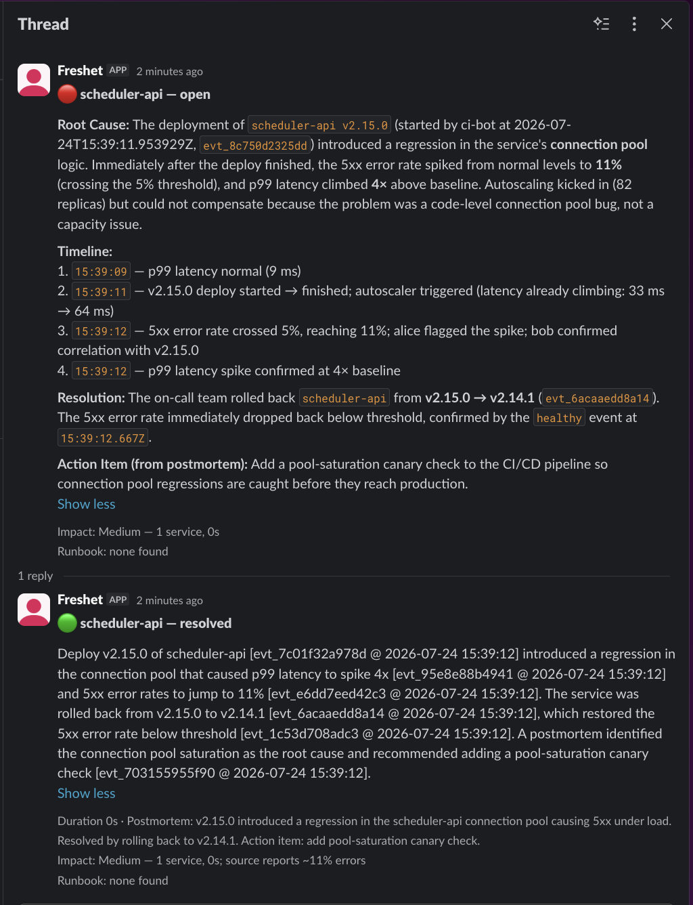
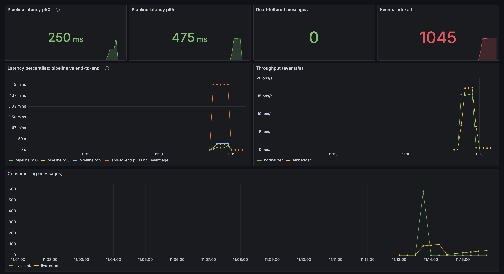

# Freshet: Real-Time Incident Intelligence

[](https://github.com/KrasiKirov/freshet/actions/workflows/ci.yml)

**Streaming RAG for on-call engineers.** Freshet ingests operational events
(deploys, alerts, metrics, incident chat, postmortems) through Kafka, indexes them
into pgvector within **seconds**, and answers *"what's breaking, and why?"* with
grounded, cited answers that abstain when the evidence is weak. It then
autonomously briefs the incident and drafts the postmortem.


*The live UI over **real** Cloudflare/GitHub/OpenAI/Discord/Reddit status incidents.*

### Why it's different

- **~356× fresher than a nightly-batch baseline** (5s vs 1778s mean data staleness).
- **Hybrid retrieval: recall@5 0.81 / nDCG@5 0.63** on a 160-query benchmark: dense
  (`bge`) + lexical + RRF fusion + cross-encoder rerank + citation verification +
  abstention, beating vector-only (0.80) and keyword-only (0.62).
- **Autonomous incident loop**: on an alert it identifies the bad **commit**, pulls
  the runbook, estimates impact, posts a **cited Slack brief**, and threads a
  **postmortem** on resolution.
- **Validated on real data it didn't generate**: 225 real public-status-feed
  incidents.

### Run it in two commands (core path needs no API key)

    make up      # Redpanda + Postgres/pgvector, waits until healthy
    make demo    # ingest a scripted incident, then answer about it

## Live demo

`make up && make live-demo` polls **real public status feeds** (Cloudflare, GitHub,
OpenAI, Discord, Reddit), streams them through the full pipeline, and opens a UI at
`http://localhost:8000` where you can ask *"what is happening with ____"* 
and get a grounded, **cited** answer over the ingested incidents, alongside a
streaming feed of each incident's severity and status.

Note: the data is **real**, but these are the providers' recent incidents,
typically **hours to days old**.

With `ANTHROPIC_API_KEY` in `.env.local`
the answers are LLM-written; without a key it falls back to a keyless cited template.
The header gauges read **pipeline latency**
(`ingested -> queryable`) rather than end-to-end freshness, because on a status feed
the event is already old on arrival, so end-to-end would measure the age of the news
instead of the speed of the pipeline.

### Autopilot (autonomous responder)

`make autopilot` runs a separate consumer that reacts to incident lifecycle
events on Kafka: when the normalizer opens a new incident, autopilot debounces
briefly, then investigates it and prints a **cited incident brief**: cause,
runbook, status. On resolution it auto-posts a
threaded, cited **postmortem** (cause + fix + duration); Slack delivery and impact
estimation are covered below.


*The pipeline spins up, one incident is injected, and the autopilot produces a cited root
cause, timeline, and action item, then a threaded postmortem on resolution.*

The same run against a real workspace, as it actually
lands in Slack:



<details>
<summary><b>Posting to your own workspace</b> (one-time Slack app setup)</summary>

1. Create a Slack app at <https://api.slack.com/apps>, choosing *From scratch*.
2. **OAuth & Permissions**: add the bot scope **`chat:write`**, then *Install to workspace*.
3. Invite the bot to a channel: `/invite @your-app`.
4. In `.env.local` (gitignored) set `SLACK_BOT_TOKEN=xoxb-...` and `SLACK_CHANNEL=#your-channel`,
   then `pip install -e ".[slack]"`.


</details>

The brief's **impact** line (Low/Medium/High from breadth, duration and error rates
quoted in the source text) is a derived *indicator*, not measured user impact.

The cause is cited as an actual **commit** when a GitHub push is ingested: `make
connector` runs an HMAC-verified webhook receiver, and `make connector-demo` replays
a push fixture plus a matching spike so the brief reads `commit <sha>: <msg> (by
<author>)`. That is a replayed fixture (real payload shape and HMAC path), not a live
repo. With it the loop is complete end to end:
**bad commit → runbook → impact → Slack brief → postmortem.**

## Results

Measured on a laptop, reproducible (`make eval` / `make drills`); full tables,
plots, and notes in [`RESULTS.md`](RESULTS.md) and [`DRILLS.md`](DRILLS.md).

- **Production-grade hybrid retrieval, measured on a 160-query benchmark**: dense
  (`bge-base-en-v1.5`) + lexical (Postgres full-text), **RRF fusion**,
  **cross-encoder reranking**, **citation verification**, and **abstention**. Hybrid
  wins recall@5 **0.81** and nDCG@5 **0.63** over vector-only (0.80) and
  keyword-only (0.62), with ground truth auto-derived alongside the corpus.
- **The retriever upgrade is measured**: swapping MiniLM-L6 for
  `bge-base-en-v1.5` lifts hybrid recall@5 **0.70 → 0.81** and nDCG@5 **0.54 → 0.63**
  on the same benchmark (deterministic before/after).
- **Optional LLM query transformation**: multi-query (paraphrase → retrieve →
  RRF-fuse) lifts recall@5 **0.78 → 0.83** on a 20-query sample (indicative,
  key-gated; an opt-in `/query` flag).
- **Root-cause synthesis recovers the true cause and fix for all 40 incidents
  across all six archetypes** (deploy / config / dependency / resource / cert /
  migration): the generalized timeline, validated service-scoped.
- **A non-semantic temporal lookup closes the hard whole-corpus gap**: with no
  service hint, single-shot retrieval reaches only 0.17 cause-recall / 0.42
  fix-recall even with the bge retriever; adding a **"what changed just before the
  spike?"** lookup reaches **1.0 / 1.0** over 12 incidents. A keyless, deterministic
  `fixed-two-step` pipeline using the same lookup **also
  scores 1.0 / 1.0, identical to the LLM agent**, so the win is the retrieval
  capability, not agency.
- **Streaming is ~356× fresher than a batch baseline** (5s vs 1778s mean data
  staleness at an hourly batch cadence; ~4 orders of magnitude at a real nightly
  cadence).

  


- **Event-to-queryable freshness p50 ≈ 2–4s** on live-generated events,
  watched live on Grafana alongside pipeline latency (`ingested -> queryable`).
- **Resilient**: no data loss when a worker is killed mid-stream, durable replay
  re-indexes the corpus after a model change, and a 10× burst drains without loss.
- **Observable**: workers export Prometheus metrics and the stack ships a
  provisioned Grafana dashboard (`make up-obs`, then
  <http://localhost:3000/d/freshet-pipeline>).

  

  *A real burst live: the poller's backlog arrives, consumer lag jumps to
  ~600 and throughput ramps to ~17 ev/s to absorb it, then lag drains back to zero
  with **0 dead-letters**. The latency panel is why pipeline latency is the default
  gauge: `pipeline p50/p95/p99` sit in the sub-second band while `end-to-end p50`
  pins at 5 min, because these are real status-feed updates that were already
  minutes old when they arrived.*

## Architecture

```
 synthetic generator ──produce──▶  Kafka: raw.events  (partition key = service)
                                        │
                                        ▼
                        normalizer (consumer group)
                          · validate → canonical Event
                          · correlate events into incidents → Postgres
                          · stamp ingested_at
                          · invalid payloads → deadletter.events
                                        │ produce
                                        ▼
                              Kafka: normalized.events
                                        │
                                        ▼
                    embedding workers (consumer group, scalable)
                          · chunk long text, embed (local bge)
                          · stamp indexed_at
                          · idempotent upsert → pgvector
                                        │
                                        ▼
   FastAPI POST /query:  hybrid retrieval (vector + keyword + filters)
                          → reciprocal-rank fusion → recency weighting (opt-in)
                          → grounded answer with [event_id @ timestamp] citations
                          → abstains when evidence is weak

 Storage:  Postgres + pgvector (one datastore: incident state + vectors)
 Metrics:  Prometheus + Grafana: freshness percentiles, lag, throughput, dead-letters
```

Every event carries three timestamps: `ts` (occurred), `ingested_at` (received),
`indexed_at` (queryable). Every freshness number derives from them.

## Run

    python3 -m venv .venv && source .venv/bin/activate
    pip install -e ".[test]"
    pytest -q                  # unit tests, no broker needed

    make up                    # Redpanda + Postgres/pgvector, waits until healthy
    make demo                  # ingest the scripted incident, then answer about it
    make down                  # tear down (drops the Postgres volume)

The core path needs **no API key**. `make demo` and `make slice` use the local
bge model (`pip install -e ".[embed]"`, ~440 MB on first use); `EMBEDDER=stub`
runs with deterministic fake embeddings and no download. Optional extras:
`.[llm]` (Anthropic-composed answers; set `ANTHROPIC_API_KEY`, pick the model
with `FRESHET_LLM_MODEL`), `.[eval]` (the evaluation harness + plots).

### Other commands

    make up-obs           # stack + Prometheus (:9090) + Grafana (:3000 dashboard)
    make slice            # stream the incident + freshness report + example query
    make api              # serve the query API + UI on :8000
    make eval             # regenerate retrieval + staleness results (results/)
    make drills           # failure drills: worker recovery, replay, burst (results/)
    make rootcause-demo   # stream the corpus, print a cited root-cause timeline
    make rootcause-eval   # completeness: did retrieval surface the true cause/fix?
    make answer-eval      # LLM-judge: extractive timeline vs LLM narrative (needs a key)
    make agent-eval       # single-shot vs fixed-two-step vs agent ablation (agent arm needs a key)
    make agent-demo       # investigate one incident, save the transcript (needs a key)
    make real-eval        # validate retrieval on real public status-feed incidents
    make embedding-compare # deterministic MiniLM-vs-bge retrieval before/after
    make multiquery-eval  # single-query vs LLM multi-query retrieval (needs a key)
    make replay           # re-index the corpus under a fresh consumer group
    make scale-demo       # WORKERS=1|3 throughput demonstration
    make test-integration # end-to-end tests against the running stack
    make db-init          # apply schema to a running stack (idempotent)

Open http://localhost:8000 for the UI (query box + live pipeline-latency/lag gauges
that read Prometheus), or query directly:

    curl -s localhost:8000/query -X POST -H 'content-type: application/json' \
      -d '{"question": "what is happening with scheduler-api?", "k": 5}'

The query returns a grounded answer that cites events as `[event_id @ timestamp]`,
or abstains when retrieval is weak.

## Layout

    freshet/common/      # schemas (the contract), kafka helpers, db helper
    freshet/generator/   # synthetic events + scripted incident scenario (--live mode)
    freshet/pipeline/    # workers: normalizer, embedder (+ embedding backends, dead-letter)
    freshet/api/         # hybrid retrieval, cross-encoder rerank, root-cause synthesis, composer, UI
    freshet/ingest/      # real status-feed poller (live-demo ingestion)
    freshet/eval/        # freshness report + evaluation harness + failure drills
    db/                  # init.sql: pgvector extension, vector_records, incidents
    scripts/             # run_slice.sh, run_scaling_demo.sh, run_demo.sh, run_live_demo.sh
    results/             # committed eval + drill artifacts (JSON, PNGs)
    tests/               # unit + integration tests
