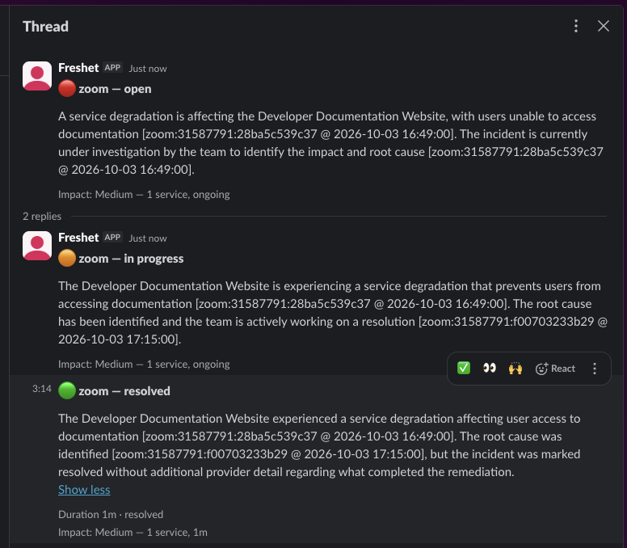

# Freshet

[](https://github.com/KrasiKirov/freshet/actions/workflows/ci.yml)

Freshet monitors **42 public status feeds** and posts incident briefs to Slack.
The terminal brief can quote a cause stated by the provider. You can also reply in the
Slack thread and ask questions about the indexed incident history. Answers cite
the updates used to produce them.


The example in [docs/example-brief.txt](docs/example-brief.txt) is an unedited
historical brief for a real Bitbucket incident. Citation IDs are checked against
the supplied evidence and timestamps are filled from that evidence. This checks
provenance, not whether every generated claim is supported.

The Slack demo shows the lifecycle in one thread: an opening brief, an amber
in-progress update, and the final resolved postmortem. It uses **real provider
evidence with manually triggered demo transitions**; the resolved state and
displayed demo duration are not a measurement of the provider's recovery.



On **2026-10-05**, a fresh Zoom demo brief was posted to Slack and a human
reply asked, “What services are affected, and what does the provider say about
the cause?” Freshet answered in the same thread, cited the incident updates,
and explicitly said that the affected services were not specified by the
provider. It attributed the explanation to the provider's scheduled-maintenance
wording rather than inventing a more specific cause. This verifies the live
follow-up path; the demo transition itself is controlled and is not evidence of
the provider's actual recovery.

## How it works

```
42 Statuspage /history.atom feeds
  │  poller — ThreadPoolExecutor + stdlib urllib, 60s sweep,
  │  ETag conditional requests, staggered start, per-host backoff
  ▼
Kafka  raw.incidents
  │  Flink SQL — checkpointed dedup by (provider, incident, update),
  │  plus a lifecycle projection (opened / in progress / resolved)
  ▼
Kafka  normalized.updates          Kafka  incident.lifecycle
  │  embedder — batches → bge → pgvector          │
  ▼                                               ▼
pgvector  ─────────────────────────────────►  Autopilot
                                              cited Slack brief on open,
                                              threaded postmortem on resolve
                                                    │
                            reply in the thread ───►│  hybrid retrieval
                                                    │  dense (bge) + full-text,
                                                    │  RRF fusion, abstention
                                                    ▼
                              LLM composer — citation IDs checked;
                              timestamps supplied from evidence
```

The feeds are polled, but everything after polling is streamed through Kafka.
The poller runs a 60-second sweep with conditional requests and per-host
backoff. Briefs read their incident's updates by key; follow-up questions use
retrieval. Current latency instrumentation records completion after acknowledged
index writes. The latest corrected live-arrival sample is reported below.

## Run it

Requires Python 3.12+, Docker with Compose, and Java 21 for the live Flink path.
From a fresh clone:

```sh
python3 -m venv .venv
.venv/bin/python -m pip install -e ".[embed,llm,slack,test]"
make up && make db-init
make check
make demo
```

`make demo` replays a committed OpenAI incident through indexing, lifecycle
handling, and rendering in **session-local temporary tables**, discarded on
exit. It prints opening, in-progress, and resolved briefs to stdout. It requires
Postgres with the schema applied, but no API key, model download, current feed
activity, running workers, or Kafka/Flink job. Default output is deterministic:
stub vectors and provider quotations are explicitly labeled. This is a lifecycle
rehearsal, not a retrieval-quality or live-streaming demonstration.

For live summaries, put `ANTHROPIC_API_KEY=...` in the gitignored `.env.local`.
`make demo ARGS=--llm` uses the real composer and incurs API charges; vectors
remain stubbed because this demo fetches evidence by incident key. Both replay
modes are stdout-only and leave live delivery state untouched.

For the live pipeline below, first use downloads the local BGE embedding model.
Add `SLACK_BOT_TOKEN=...` and `SLACK_CHANNEL=...` to `.env.local` only for Slack
delivery. Install the Slack app in the target channel with `chat:write` and the
appropriate conversation-history scope for thread replies. The default sink is
stdout. Choose one autopilot sink, rather than running both consumers together.

Run the long-lived processes in separate terminals:

```
make up && make db-init
make stream      # submits the Flink dedup + lifecycle job
make poller      # polls the 42 feeds
make embedder    # indexes into pgvector
make autopilot   # live consumer, prints briefs to stdout
FRESHET_SINK=slack make autopilot  # posts cited briefs to Slack
make demo-brief ARGS=--dry-run  # inspect eligible current incidents
make demo-brief  # manually triggers an opening event; needs an eligible incident
make demo-brief ARGS='--repeat --service zoom'     # repeat a current open incident
make demo-brief ARGS='--progress --service zoom'  # post an amber in-progress update
make demo-brief ARGS='--resolve --service zoom'    # trigger its threaded postmortem
make index-ready # waits for replay/catch-up to drain before evaluation
make freshness   # live-arrival latency + index snapshot
make live-eval   # retrieval evaluation against the current index
make check       # lint, type-check, and run the unit suite
```

Use `make demo` for a repeatable interview rehearsal. `demo-brief` operates on
live delivery state: `--repeat` resets the selected incident's demo state, and
`--progress`/`--resolve` inject controlled transitions; they do not confirm a
provider's actual progress or recovery. Do not use them as autonomous-delivery
evidence. A current incident may not be eligible on the day of an interview.

The first cold poll can replay the history exposed by a feed. That is expected
when building the corpus, but it can take a while to reach pgvector. Keep the
stream and embedder running until `make index-ready` reports zero lag; both
`make live-eval` and `make freshness` run that guard automatically. The normal
poll cache is persistent, so do not point `FRESHET_POLL_CACHE` at a temporary
file unless you intentionally want another bootstrap replay.

On macOS, `mkdir -p logs && ./deploy/run-live.sh > logs/supervisor.log 2>&1`
replaces the poller/embedder/autopilot targets: it restarts any child that
dies and blocks idle sleep. It enables real Slack delivery. Freshness uses the
embedder heartbeat to choose its default observation window.

`make test` runs the unit suite; `make test-integration` needs the stack up
and uses a dedicated `freshet_test` database.

## Project status

This is a portfolio prototype with ingestion, streaming deduplication, lifecycle
events, retrieval, Slack delivery, replay, and automated checks. The isolated
replay is suitable for rehearsal. Production readiness and user-impact claims
require validation beyond this local stack and its small observed workload.

## Measured

| | |
|---|---|
| staleness | **149.71s mean**, **82.93s p50**, **246.20s p95** — 20 live updates; 12.03× versus a modeled hourly batch wait |
| retrieval ranking (reported recall@5) | hybrid **0.699**, vector_only **0.838**, keyword_only 0.330, blind-recent control 0.002 — 1,312 queries, before abstention |
| autonomous delivery | **3 of 3** real incidents briefed with no human trigger in the September 4 run; all three completed open → brief → resolve → threaded postmortem |

The saved freshness report contains a 20-update live-arrival sample. Version 2
records an event completion receipt after all chunk writes are acknowledged,
preserves the first completion across replays, and records reindexing separately.
Legacy rows cannot be scored with this instrumentation. The sample is useful but
small, so its p95 is unstable. The hourly batch comparison is modeled, not a
second deployed system.

The retrieval test measures whether the rest of an incident can be found from
its opening update, before the abstention decision. Here “recall@5” is the fraction
of queries finding at least one other update in the top five distinct events.
It does not measure Slack answer quality, citation entailment, or causal
identification. On this task, vector search performs better than the hybrid arm
because the keyword arm is weak.

Full method, derivations, and what was built and then deleted: [RESULTS.md](RESULTS.md).

The compact machine-readable results are [freshness.json](results/freshness.json)
and [live_retrieval.json](results/live_retrieval.json).

## Limitations

- An earlier sample found explicit causes in only about 4% of incidents. The
  extractive cause field quotes source text; this is not a measured guarantee
  about the LLM narrative or the current corpus.
- Forty-two providers is a small corpus. The measurements describe this feed
  set, not status pages in general.
- Citation provenance checks remove unknown IDs and fill timestamps from evidence.
  They do not verify semantic support; uncited or unsupported prose can remain.
- Delivery is at-least-once. A crash after a Slack post but before the database
  update can result in a duplicate rather than a lost alert.
- Ingestion uses Statuspage Atom feeds, not the `/api/` endpoints disallowed by
  `robots.txt`.
