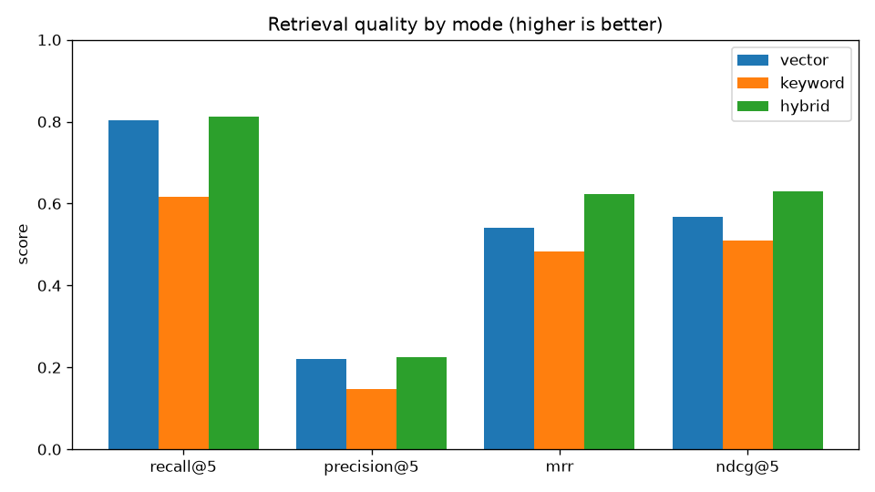
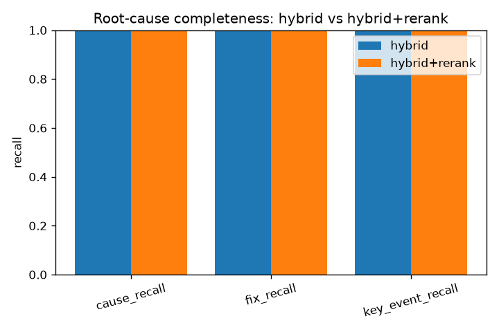
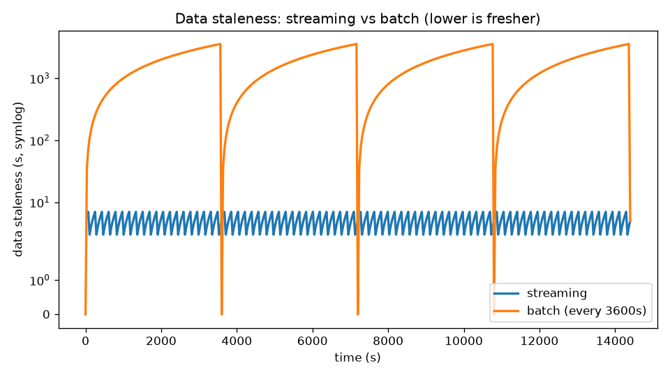

# Results

Reproducible numbers, newest first. Hardware context: Apple Silicon laptop,
single-node Redpanda + Postgres in Docker, workers on the host.

## M14 — RAG quality: stronger retriever + query transformation

This is a standard production-RAG stack — dense + lexical hybrid, RRF fusion,
cross-encoder reranking, citation verification, measured on a 160-query benchmark.
M14 levels up the two pieces that were still weak: the embedding model and query
transformation.

**Embedding model — MiniLM-L6 → bge-base-en-v1.5 (768-dim).** Re-running the
deterministic 160-query benchmark with the upgraded retriever (query-side
instruction prefix included):

| mode | recall@5 (MiniLM → bge) | nDCG@5 (MiniLM → bge) |
|---|---|---|
| keyword-only | 0.609 → 0.616 | 0.502 → 0.510 |
| vector-only | 0.672 → **0.803** (+0.13) | 0.517 → 0.567 |
| **hybrid** | 0.697 → **0.812** (+0.12) | 0.535 → **0.631** (+0.10) |

Honest read: bge is a large, real win on the embedding-dependent arms — hybrid
recall@5 **0.70 → 0.81** and nDCG@5 **0.54 → 0.63**. Keyword-only barely moves
(+0.006 ≈ one query of SQL tie-order noise); it uses no embeddings, so that is
expected. The MiniLM column is a frozen snapshot of the prior committed run
(`results/retrieval_metrics_minilm.json`) — the pgvector column is a fixed
dimension, so 384-dim and 768-dim models cannot index into the same DB; only the
bge "after" is run live. Reproduce: `make up && make embedding-compare`.

**Query transformation — LLM multi-query.** An LLM rewrites the question into
paraphrases; each is retrieved and the results are RRF-fused. Measured single-vs-
multi on 20 benchmark queries:

| config | recall@5 |
|---|---|
| single-query | 0.775 |
| **multi-query** | **0.825** (+0.05) |

Honest read: a real, modest lift (+0.05) even on the benchmark's already-clean
auto-derived queries. **Indicative and non-deterministic** (one committed run;
paraphrases by `claude-sonnet-4-6`) — an earlier run scored +0.10, which is the
point of labeling it indicative. Key-gated. Reproduce (needs a key):
`make multiquery-eval`. Multi-query is also an opt-in `/query` flag (off by
default, key-gated).

## M11 — multi-step retrieval vs single-shot baseline

> **Framing note (revised in M14):** this was previously sold as "agentic RAG."
> The honest read is narrower. What it shows is that a **non-semantic temporal
> lookup** (`get_events_around`, "what happened just before the spike?") closes a
> gap that single-shot semantic retrieval cannot — *not* that the LLM agency adds
> measurable value over a fixed pipeline. A deterministic two-step pipeline using
> the same temporal tool would likely match the numbers below; that ablation is
> open. The win is the **retrieval capability**, not the agent loop.

M12 measured a sharp gap: at **whole-corpus scale** (no service hint), single-shot
retrieval scored **0.0 cause-recall** under the old MiniLM retriever — a terse
`Deploy v2.15.0 started` event is not semantically similar to "what caused this
incident?". The stronger bge retriever (M14) lifts the baseline but does **not**
close the gap; the multi-step investigator re-retrieves with the temporal lookup to
recover the rest.

Measured head-to-head on **12 sampled incidents (2 per archetype)**, both at
whole-corpus scale, under the bge retriever (agent paraphrases by
`claude-sonnet-4-6`):

| config | cause_recall | fix_recall |
|---|---|---|
| single-shot (keyless baseline) | 0.167 | 0.417 |
| **multi-step + temporal lookup** | **1.000** | **1.000** |
| **lift** | **+0.833** | **+0.583** |

Honest read: the multi-step path recovers the true cause and fix on **all 12
incidents across all six archetypes**. The bge upgrade raised the single-shot
baseline from 0.0/0.25 (MiniLM) to 0.17/0.42 — a better retriever genuinely helps —
but it still misses most causes, which the temporal lookup recovers. Caveats kept
in front: (1) the LLM run is **indicative and non-deterministic**, so the committed
JSON is one run; the baseline is keyless and
deterministic. (2) The sample is small (12) by design. (3) The lift is attributable
to the temporal **tool**, not proven to require the agent loop — see the framing
note above.

Reproduce (needs a key): `make up && make agent-eval`. A sample investigation
transcript a keyless clone can read is committed at
[`results/agent_transcript.md`](results/agent_transcript.md), and
`make agent-demo` regenerates it.

## M12 — benchmark-scale evaluation (supersedes the toy-scale numbers below)

The earlier evals ran on a handful of queries against a single incident. M12
replaces them with a **seeded 40-incident benchmark spanning six failure
archetypes** (deploy regression, config change, dependency outage, resource
exhaustion, cert expiry, bad migration). Ground truth (each incident's spike,
cause, and fix event) is authored *with the corpus*, and ~160 labeled retrieval
queries are **auto-derived** from it — so the numbers are not hand-picked to
flatter. Recency decay is disabled in eval (`tau≈∞`) so every figure is
deterministic; re-running produces byte-identical JSON.

Reproduce: `make up && make eval && make rootcause-eval`.

**Retrieval quality** — 160 auto-derived queries (mean, k=5), all-MiniLM-L6-v2.
*(Superseded by the bge numbers in M14 above; kept as the MiniLM baseline.)*

| mode | recall@5 | precision@5 | MRR | nDCG@5 |
|---|---|---|---|---|
| keyword-only | 0.609 | 0.144 | 0.474 | 0.502 |
| vector-only | 0.672 | 0.170 | **0.500** | 0.517 |
| **hybrid** | **0.697** | **0.179** | 0.499 | **0.535** |

Honest read: at 160 varied queries, **hybrid wins recall@5 and nDCG@5** over
either arm alone — the headline claim survives the harder benchmark. MRR is a
**dead heat** (vector edges hybrid by 0.001), so hybrid's win is about surfacing
*more* relevant events, not ranking the first one higher. precision@5 is low
across the board (~0.18) because each query has only a few relevant events, which
caps precision@5 mechanically; recall@5 and nDCG@5 are the meaningful columns.
Every number is lower than the 6-query table below — that is the point: this is a
credible measurement, not a flattering one.

**Root-cause completeness** — 40 incidents, service-scoped retrieval (k=12,
mirroring the product's root-cause path), generalized timeline:

| config | cause_recall | fix_recall | key_event_recall |
|---|---|---|---|
| hybrid | 1.000 | 1.000 | 1.000 |
| hybrid+rerank | 1.000 | 1.000 | 1.000 |

Honest read: once an incident is in scope, the generalized timeline recovers its
true cause and fix for **all 40 incidents across all six archetypes** — not just
deploy/rollback but config reverts, dependency failovers, scale-ups, cert
renewals and migration reverts (`CHANGE_TYPES`/`REMEDIATION_TYPES`). This eval
isolates *synthesis*; the hard *retrieval* number is the table above.
Cross-encoder reranking is **neutral** here (both 1.0) — at benchmark scale with
isolable incidents it neither helps nor hurts cause/fix capture, which updates
the toy-scale M10a observation that rerank appeared to hurt completeness.

## M6 — retrieval quality + streaming-vs-batch (the differentiator)

> The retrieval table here is the original **toy-scale** measurement (6 queries,
> one incident), kept for history. It is superseded by the 160-query benchmark in
> M12 above. The streaming-vs-batch result below is unchanged and still current.

Reproduce: `make up && make eval` (needs `.[embed]` `.[eval]`). Deterministic —
fixed-seed corpus + MiniLM. Synthetic-data numbers are indicative, not a
real-world benchmark; the batch side of the staleness graph is a model computed
from a steady event stream at the generator's cadence (the comparison isolates
ingestion cadence, not the scripted incident's narrative timing).

**Retrieval quality** over 6 authored queries (mean, k=5), all-MiniLM-L6-v2:

| mode | recall@5 | precision@5 | MRR | nDCG@5 |
|---|---|---|---|---|
| keyword-only | 0.667 | 0.200 | 0.417 | 0.490 |
| vector-only | 0.667 | **0.233** | 0.389 | 0.481 |
| **hybrid** | **0.722** | 0.200 | **0.431** | **0.504** |

Honest read: **hybrid wins recall@5, MRR, and nDCG@5** — fusing the two arms
surfaces relevant events neither finds alone. It does **not** win precision@5:
vector-only is tightest at the very top (0.233), because fusion pulls in extra
keyword candidates that dilute precision while lifting recall. That trade-off is
the expected shape of reciprocal-rank fusion, reported rather than hidden. (The
keyword arm uses OR semantics — ANDing every word of a natural-language question
against terse events zeroes recall and is a strawman baseline.)

**Streaming vs batch staleness** — mean data staleness **5.0s (streaming)** vs
**1778s (batch at a 3600s cadence)**: **~356× fresher**. At a real nightly
cadence (86400s) the gap is ~four orders of magnitude. Staleness = query-time
minus newest queryable event.

Resilience drills (worker kill/recovery, replay re-index, burst backpressure)
with evidence graphs: see [`DRILLS.md`](DRILLS.md).

## M4 — consumer-group scaling (embedder, all-MiniLM-L6-v2)

1,009 live events produced as an instantaneous burst into 3-partition topics,
time measured from burst start to all events queryable in pgvector
(`make scale-demo`, 2026-06-12):

| embedder instances | drain time | throughput |
|---|---|---|
| 1 | 15s | 67 ev/s |
| 3 | 10s | 100 ev/s |

Honest read: the 1.5× speedup is embedder scaling working until the *next*
bottleneck appears — at 3 instances the single normalizer caps the pipeline at
~100 ev/s, because it does a delivery-checked (per-message flushed) produce per
event. A lighter burst (309 events) shows no speedup at all: one embedder
already keeps up, so there is nothing to parallelize. Scaling consumers moves
bottlenecks; it does not delete them.

Reproduce: `make down && make up && WORKERS=1 make scale-demo` (then WORKERS=3).

## M2 — event-to-queryable freshness (slice demo, real embedder)

p50 ≈ 2–4 s, p95 ≈ 6–8 s over 69 live events (`make slice`; printed by
`freshet.eval.freshness`). This measured streaming freshness is the floor used
for the M6 streaming-vs-batch comparison above.
