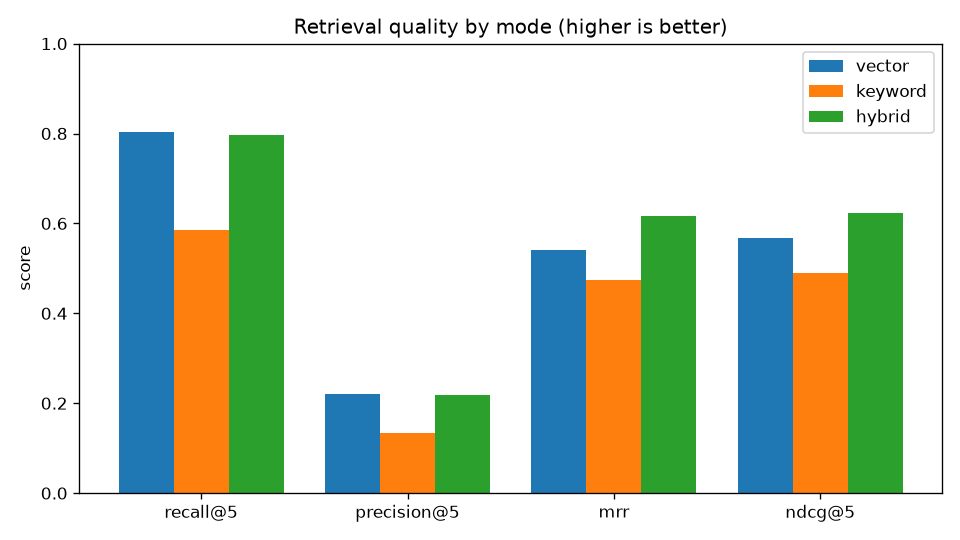
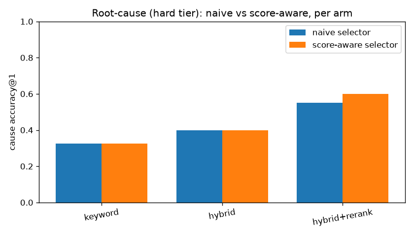
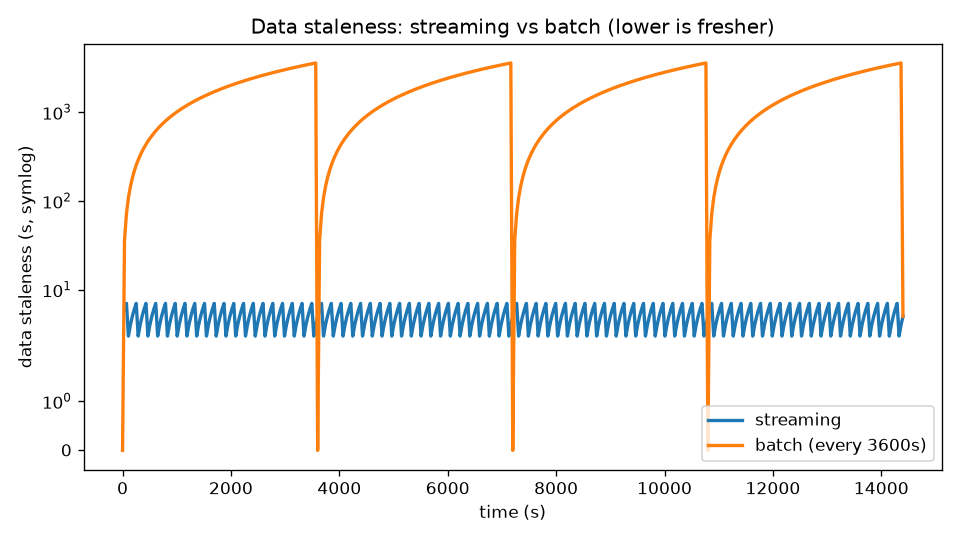

# Results

Reproducible numbers, newest first. Hardware context: Apple Silicon laptop,
single-node Redpanda + Postgres in Docker, workers on the host.

## Impact estimation (indicative, keyless)

The autopilot's impact line is a *derived indicator*: Low/Medium/High from breadth,
duration, and error-percentages quoted in the incident text. It is **not** measured
user impact (no error-rate/affected-user metrics exist in the corpus). `make
impact-eval` measures how well those observable proxies recover an **authored,
severity-driven** label on a dedicated benchmark (12 incidents spanning Low/Med/High;
the shared retrieval benchmark is untouched): exact agreement 0.583, adjacent-
tolerant agreement 0.917 (Low/High counts as a worse miss than Low/Medium). The
misses are honest: incidents that were severe but quiet in their observable signals
(under-estimated), and a small-but-loud spike (over-estimated).

## M15: real-data validation (off the synthetic benchmark)

Every other number here is measured on the seeded generator's own corpus, which
the system was built against (the synthesis eval saturates at 1.0). This
milestone is the first measurement on data the system did **not** generate: 225
real incidents (841 updates) snapshotted from the five public Statuspage feeds
the live poller already watches (Cloudflare, GitHub, Reddit, Discord, OpenAI),
run through the **same** `map_incident` code path live polling uses. Committed
snapshots plus hand-labels make it deterministic. Reproduce: `make up && make
real-eval`. Refresh the snapshots with `python scripts/fetch_real_incidents.py`
(re-curate labels afterward).

**The first finding is in the labeling.** Of 225 resolved incidents, only **12**
have any update that states an actual cause. The modal real update is *"the issue
has been identified and a fix is being implemented"*, which names no cause and is
deliberately left unlabeled. GitHub writes true postmortems in its resolved update
(*"On <date>... due to <cause>"*); the other providers state the cause mid-incident
or not at all. The 12 labeled causes span config-change rollback, backend-service
failure, capacity/traffic surge, upstream-dependency outage (AWS, an upstream model
provider, GitHub-as-dependency), DB-migration replication lag, DNSSEC, and
networking. (A 13th candidate, Discord voice/video, was dropped on review: its
strongest update names the *effect*, "a capacity drop... working with our partner",
but never the cause, so it fails the same bar that excludes the other 212.)

**Retrieval**, whole-corpus (all five providers indexed together, no service
hint), recency-neutral, bge, scored on whether the cause-bearing update is
retrieved for the incident's natural question:

| metric | value | reading |
|---|---|---|
| recall@5 | **0.917** (11/12) | the cause update is in the top 5 for all but one incident |
| MRR | 0.576 | when found, it lands around rank 2 on average |
| top-1 citation | 0.417 (5/12) | the *literal* top hit is the cause update under half the time |

Honest read: retrieval **surfaces** the real cause reliably (92% in top-5), but
the keyless composer cites the **top** hit, and that is the cause update only 42%
of the time. The other updates of the same incident ("investigating...",
"resolved") are often more similar to *"what caused X?"* than the cause sentence
itself. This is the same gap the synthetic M11 showed (single-shot retrieval gets
close but misses the precise cause event; the temporal lookup recovers it), now
confirmed on real language, not just the generator's. The one recall miss
(Reddit/AWS us-east-1) ranked #7: the query was semantically pulled toward several
near-duplicate *"Degraded performance for reddit.com"* incidents, and the cause
update surfaced on the keyword arm alone.

**Abstention transfers.** The bge floor calibrated on the synthetic corpus (0.70,
M14/hardening) holds on real language with no retuning: **0/12** on-corpus queries
abstained (all real questions cleared the floor) and **8/8** off-corpus queries
abstained (4 ops-flavored hard negatives about services these feeds don't cover
plus 4 unrelated). That the synthetic-calibrated floor separates real on/off-corpus
queries cleanly is the strongest single piece of evidence that the calibration
isn't overfit to the generator.

**Recency decay, measured, and turned off by default.** Production used to apply
a demo-tuned exponential decay (~21-min half-weight) that no eval had ever
measured. A tau sweep over the same 12 labeled queries (ages fixed against the
snapshot, so the numbers are deterministic; median event age ~44 days) closes
that blind spot:

| tau | recall@5 | MRR | top-1 |
|---|---|---|---|
| 30m (old default) | 0.500 | 0.243 | 0.083 |
| 6h | 0.250 | 0.167 | 0.083 |
| 24h | 0.250 | 0.167 | 0.083 |
| 7d | 0.333 | 0.183 | 0.083 |
| 30d | 0.500 | 0.232 | 0.083 |
| 90d | 0.667 | 0.378 | 0.250 |
| 180d | 0.750 | 0.433 | 0.250 |
| 365d | 0.833 | 0.472 | 0.250 |
| **neutral (new default)** | **0.917** | **0.576** | **0.417** |

Two findings. (1) **No decay level is free**: recovery is monotone from 30d
upward, but even a one-year half-life still loses ~8 recall points and a third of
MRR versus neutral. Retrospective root-cause questions need old evidence, and
multiplying scores by `exp(-age/tau)` punishes exactly that. (2) The old 30m
default wasn't even a working freshness bias: at 44-day median age every score
underflows to float **0.0**, all hits tie, and the sort silently falls back to
RRF order. That's why 30m scores *better* than 6h in the table (degeneracy,
not decay, was ranking). So the default is now **recency-neutral**, and decay is
**opt-in** (`FRESHET_TAU_S`) for live "what's breaking right now?" views, where
its benefit is plausible (the Reddit/AWS miss above was semantic pull
toward *older* near-duplicate incidents) but has no labeled queries yet. This
project does not ship unmeasured defaults that measurably hurt the measured
workload.

Caveats kept in front: (1) 12 labeled incidents is small, a floor for
signal, not a stable percentage. (2) Labels are reviewed judgment calls (which
update "states the cause"), `curated: reviewed` in `labels.json` with a per-
incident rationale. (3) `build_timeline`'s cause *selection* is not scored here;
real updates are typed investigating/identified/resolved, never CHANGE_TYPES, so
it structurally abstains (see `make rootcause-facevalidity`). This milestone
measures retrieval and citation, which is what applies to real status-feed data.

## M14: RAG quality, stronger retriever plus query transformation

This is a standard production-RAG stack: dense + lexical hybrid, RRF fusion,
cross-encoder reranking, citation verification, measured on a 160-query benchmark.
M14 levels up the two pieces that were still weak: the embedding model and query
transformation.

**Embedding model, MiniLM-L6 → bge-base-en-v1.5 (768-dim).** Re-running the
deterministic 160-query benchmark with the upgraded retriever (query-side
instruction prefix included):

| mode | recall@5 (MiniLM → bge) | nDCG@5 (MiniLM → bge) |
|---|---|---|
| keyword-only | 0.609 → 0.584 | 0.502 → 0.490 |
| vector-only | 0.672 → **0.803** (+0.13) | 0.517 → 0.567 |
| **hybrid** | 0.697 → **0.797** (+0.10) | 0.535 → **0.624** (+0.09) |

Honest read: bge is a large, real win on the embedding-dependent arms: hybrid
recall@5 **0.70 → 0.80** and nDCG@5 **0.54 → 0.62**, vector recall@5 **0.67 →
0.80**. Keyword-only uses no embeddings, so its recall is fixed by the corpus,
the queries, and the tie-break; the MiniLM→bge delta there (0.609 → 0.584) is
**not** an embedding effect but the SQL tie-order noise this benchmark used to
carry. The keyword arm's `ts_rank` produces many ties, and until a deterministic
`ORDER BY ..., chunk_id` tiebreak was added they resolved by physical heap order,
so each run (the eval DELETEs and re-INSERTs the corpus) drew a slightly
different number. That is now pinned; re-running yields byte-identical JSON (see
M12). On recall@5, hybrid (0.797) and vector (0.803) are a **statistical dead
heat**, within one query of each other, but hybrid decisively wins **nDCG@5
(0.624 vs 0.567)** and MRR (0.616 vs 0.541): it ranks the relevant events higher
even when the retrieved set is comparable. The MiniLM column is a frozen snapshot
of the prior committed run (`results/retrieval_metrics_minilm.json`), taken
before the tiebreak fix; the pgvector column is a fixed dimension, so 384-dim and
768-dim models cannot index into the same DB, and only the bge "after" is run
live. Reproduce: `make up && make embedding-compare`.

**Query transformation: LLM multi-query.** An LLM rewrites the question into
paraphrases; each is retrieved and the results are RRF-fused. Measured single-vs-
multi on 20 benchmark queries:

| config | recall@5 |
|---|---|
| single-query | 0.775 |
| **multi-query** | **0.825** (+0.05) |

Honest read: a real, modest lift (+0.05) even on the benchmark's already-clean
auto-derived queries. **Indicative and non-deterministic** (one committed run;
paraphrases by `claude-sonnet-4-6`); an earlier run scored +0.10, which is the
point of labeling it indicative. Key-gated. Reproduce (needs a key):
`make multiquery-eval`. Multi-query is also an opt-in `/query` flag (off by
default, key-gated).

## M11: multi-step retrieval vs single-shot baseline

> **Framing note (rebuilt 2026-08-17). This benchmark was wrong three times; the
> audit trail is the point.** (1) The original *easy* tier gave each incident
> exactly one cause-typed and one remediation-typed event in the ±30-min window, so
> both scored tasks were single-candidate. A keyless heuristic "tied" the LLM at
> 1.000/1.000 — a **tautology**, not a result, and it produced the published claim
> "agency adds nothing." (2) The first hard tier added a decoy per task but planted
> both at **constant offsets**, so a blind index rule ("second-to-last change,
> second remediation") scored **1.000/1.000 and beat the LLM while understanding
> nothing**. The claim that reasoning beats fixed heuristics was therefore
> unsupported: one arbitrary rule lost, another arbitrary rule won. (3) Randomising
> the trap counts fixed the cause axis but left every failed attempt *before* the
> real fix, so a blind "last remediation" rule still scored **0.931**.
>
> The current tier randomises trap counts on both sides (0–3 benign changes before
> the spike, 0–2 failed remediations after it, 0–2 cleanup remediations after
> recovery), includes the **zero** case so the naive rule is sometimes right, and
> hides the cause outside the lookup window on exactly every 4th incident, where
> abstaining is the calibrated answer. A **gameability guard** — blind index rules,
> reported on every run against an explicit chance ceiling — now makes
> ungameability a *measured property* rather than a claim. It is what caught leak
> (3), and it is permanent so leak (4) cannot ship silently.

M12 measured a sharp gap: at **whole-corpus scale** (no service hint), single-shot
retrieval scored **0.0 cause-recall** under the old MiniLM retriever. A terse
`Deploy v2.15.0 started` event is not semantically similar to "what caused this
incident?" The stronger bge retriever (M14) lifts the baseline but does **not**
close the gap; the multi-step investigator re-retrieves with the temporal lookup to
recover the rest.

Measured on all **40 hard-tier incidents** under the bge retriever, keyless arms
only (2026-08-17). `cause*` is recall on the 30 in-window incidents; the headline
`cause` column is diluted by the 10 where abstaining is correct. Abstentions are
reported separately from wrong answers, because naming a bystander and saying "I
don't know" are different failures for an on-call tool:

| config | cause | cause* | fix | false pos. | correctly abstained |
|---|---|---|---|---|---|
| single-shot (keyless) | 0.075 | 0.100 | 0.325 | 32 | 0/10 |
| fixed-two-step, whole-corpus | 0.050 | 0.067 | 0.075 | 10 | 9/10 |
| fixed-two-step, service-scoped | 0.175 | 0.233 | 0.350 | 33 | 0/10 |
| **hardened heuristic (keyless)** | **0.425** | **0.567** | **1.000** | 23 | 0/10 |
| *gameability guard (blind index rules)* | *≤0.175* | — | *≤0.450* | — | — |
| *chance ceiling* | *0.250* | — | *0.333* | — | — |

**The guard passes, with one number to keep watching.** On cause, every blind index
rule is at or below the 0.250 ceiling (best: 0.175) — the axis that was previously
gameable at 1.000 is now dead. On fix, two of three sit at the 0.333 ceiling; the
third reaches **0.450**, which is 1.6σ above chance at n = 40 (not significant,
p ≈ 0.12, but it is not "below the ceiling" either and is recorded as such rather
than rounded away). It reflects the residual 1-in-3 chance that no cleanup
remediation follows recovery, which leaves the real fix last. Widening the cleanup
draw would push it down further. The naive service-scoped rule (0.175 / 0.350) is
statistically indistinguishable from the blind rules — the correct result, since it
*is* a blind rule.

Two findings, and the second is uncomfortable:

1. **The fix task does not need an LLM.** A hand-written rule — "the last
   remediation at or before the recovery event" — scores **1.000**. Agency
   therefore cannot add anything on fix identification; any agent result there is
   at best a tie. This is the honest replacement for the old, meaningless 1.000:
   the number is high because the task is genuinely solvable by a simple evidence
   rule, and that is now demonstrated rather than assumed.
2. **The cause task has real headroom, and so does calibration.** The hardened
   heuristic reaches only **0.567** in-window, and abstains correctly on **0/10**
   of the out-of-window incidents — it always guesses. Those two numbers are the
   bar the agent has to clear to justify its cost.

**The agent arm has not been re-run against this tier.** The previously published
0.917/1.000 was measured on the gameable corpus and is void; it is removed rather
than carried forward. The keyless instrument was validated first precisely because
it is free — running the agent against a benchmark that fails its own guard would
have been wasted spend.

Reproduce: `make up && make agent-eval` (hard tier, all 40 incidents; set
`FRESHET_EVAL_PER_ARCHETYPE=2` for a 12-incident subset). Keyless arms are
deterministic and reproduce exactly; the agent arm needs `ANTHROPIC_API_KEY`. The
artifact records seed, embedder, model, run date, the guard, and a paired McNemar
test against the strongest keyless baseline.
A sample investigation transcript a keyless clone can read is committed at
[`results/agent_transcript.md`](results/agent_transcript.md), and
`make agent-demo` regenerates it.

## M12: benchmark-scale evaluation (supersedes the toy-scale numbers below)

The earlier evals ran on a handful of queries against a single incident. M12
replaces them with a **seeded 40-incident benchmark spanning six failure
archetypes** (deploy regression, config change, dependency outage, resource
exhaustion, cert expiry, bad migration). Ground truth (each incident's spike,
cause, and fix event) is authored *with the corpus*, and ~160 labeled retrieval
queries are **auto-derived** from it, so the numbers are not hand-picked to
flatter. Recency decay is disabled in eval (`tau≈∞`) and both retrieval arms
break score ties on `chunk_id` (so tied rows never fall back to non-deterministic
physical heap order), making every figure deterministic; re-running produces
byte-identical JSON regardless of `PYTHONHASHSEED`.

Reproduce: `make up && make eval && make rootcause-eval`.

**Retrieval quality**, 160 auto-derived queries (mean, k=5), all-MiniLM-L6-v2.
*(Superseded by the bge numbers in M14 above; kept as the MiniLM baseline.)*

| mode | recall@5 | precision@5 | MRR | nDCG@5 |
|---|---|---|---|---|
| keyword-only | 0.609 | 0.144 | 0.474 | 0.502 |
| vector-only | 0.672 | 0.170 | **0.500** | 0.517 |
| **hybrid** | **0.697** | **0.179** | 0.499 | **0.535** |

Honest read: at 160 varied queries, **hybrid wins recall@5 and nDCG@5** over
either arm alone; the headline claim survives the harder benchmark. MRR is a
**dead heat** (vector edges hybrid by 0.001), so hybrid's win is about surfacing
*more* relevant events, not ranking the first one higher. precision@5 is low
across the board (~0.18) because each query has only a few relevant events, which
caps precision@5 mechanically; recall@5 and nDCG@5 are the meaningful columns.
Every number is lower than the 6-query table below; that is the point: this is a
credible measurement, not a flattering one.

**Root-cause completeness**, 40 incidents, service-scoped retrieval (k=12,
mirroring the product's root-cause path), generalized timeline:

| config | cause_recall | fix_recall | key_event_recall |
|---|---|---|---|
| hybrid | 1.000 | 1.000 | 1.000 |
| hybrid+rerank | 1.000 | 1.000 | 1.000 |

Honest read: once an incident is in scope, the generalized timeline recovers its
true cause and fix for **all 40 incidents across all six archetypes**, not just
deploy/rollback but config reverts, dependency failovers, scale-ups, cert
renewals and migration reverts (`CHANGE_TYPES`/`REMEDIATION_TYPES`). This eval
isolates *synthesis*; the hard *retrieval* number is the table above.
Cross-encoder reranking is **neutral** here (both 1.0). At benchmark scale with
isolable incidents it neither helps nor hurts cause/fix capture, which updates
the toy-scale M10a observation that rerank appeared to hurt completeness.

### Root-cause (hard tier)

The `easy` benchmark tier saturated (hybrid and hybrid+rerank both 1.0/1.0), so it is
retained only as a fast smoke/regression baseline. The `hard` tier interposes a benign
decoy change between the true cause and the spike (near-duplicate vocab) plus
same-service distractor volume, so retrieval and cause selection must actually work.

Metrics over the keyword → hybrid → hybrid+rerank ladder, naive (last-before-spike) vs
score-aware (retrieval-rank × spike-proximity) selection, 40 hard-tier incidents
(`results/rootcause_eval.json`):

| arm | recall@k | accuracy (naive) | accuracy (score-aware) | MRR (score-aware) |
|---|---|---|---|---|
| keyword | 0.625 | 0.375 | 0.375 | 0.446 |
| hybrid | 0.575 | 0.425 | 0.400 | 0.483 |
| hybrid+rerank | 0.650 | 0.550 | 0.600 | 0.613 |

Honest reading: the score-aware selector reliably helps only on the **hybrid+rerank**
arm (0.55 → 0.60), where the cross-encoder gives it an informative ranking. On
**keyword** the rank is uninformative, so it ties naive (0.375). On plain **hybrid** it
is marginally *worse* than naive (0.400 vs 0.425, a single incident): the first-stage
fused rank can seat a benign decoy above the true cause and mislead the selector, and
only reranking separates them cleanly enough to win. Cause accuracy still rises with arm
sophistication (naive 0.375 → 0.425 → 0.55; score-aware 0.375 → 0.40 → 0.60). recall@k
is non-monotonic (0.625 → 0.575 → 0.65): plain hybrid's tighter top-k drops the true
cause more often than keyword's looser match, and reranking pulls it back into the cut.
These figures are byte-reproducible: a deterministic `chunk_id` tiebreak in the
retrieval SQL (same branch) removes the heap-order non-determinism that previously
inflated keyword recall to a spurious 1.0.

Real-data face validity: over the committed real status-feed incidents (symptom-only,
`make rootcause-facevalidity`), the cause selector abstains on **1/1 = 1.00** of
incidents; it does not fabricate a root cause when no change event is in evidence.
One honest nuance: the fixture incident's update text names a deploy in prose ("a bad
WAF rule deploy is the cause"), but its event type is `identified` (a status label, not
a change type), so the extractive selector correctly does **not** fabricate a
structured cause from prose. That is disciplined abstention, not a miss. This is face
validity, not accuracy: public status feeds carry no event-level cause labels, so the
labeled ladder above is synthetic. Event-level real root-cause labels require internal
deploy+incident+postmortem access no public API provides.

## M6: retrieval quality plus streaming-vs-batch (the differentiator)

> The retrieval table here is the original **toy-scale** measurement (6 queries,
> one incident), kept for history. It is superseded by the 160-query benchmark in
> M12 above. The streaming-vs-batch result below is unchanged and still current.

Reproduce: `make up && make eval` (needs `.[embed]` `.[eval]`). Deterministic:
fixed-seed corpus plus MiniLM. Synthetic-data numbers are indicative, not a
real-world benchmark; the batch side of the staleness graph is a model computed
from a steady event stream at the generator's cadence (the comparison isolates
ingestion cadence, not the scripted incident's narrative timing).

**Retrieval quality** over 6 authored queries (mean, k=5), all-MiniLM-L6-v2:

| mode | recall@5 | precision@5 | MRR | nDCG@5 |
|---|---|---|---|---|
| keyword-only | 0.667 | 0.200 | 0.417 | 0.490 |
| vector-only | 0.667 | **0.233** | 0.389 | 0.481 |
| **hybrid** | **0.722** | 0.200 | **0.431** | **0.504** |

Honest read: **hybrid wins recall@5, MRR, and nDCG@5**; fusing the two arms
surfaces relevant events neither finds alone. It does **not** win precision@5:
vector-only is tightest at the very top (0.233), because fusion pulls in extra
keyword candidates that dilute precision while lifting recall. That trade-off is
the expected shape of reciprocal-rank fusion, reported rather than hidden. (The
keyword arm uses OR semantics; ANDing every word of a natural-language question
against terse events zeroes recall and is a strawman baseline.)

**Streaming vs batch staleness**: mean data staleness **5.0s (streaming)** vs
**1778s (batch at a 3600s cadence)**, **~356× fresher**. At a real nightly
cadence (86400s) the gap is ~four orders of magnitude. Staleness equals query-time
minus newest queryable event.

Resilience drills (worker kill/recovery, replay re-index, burst backpressure)
with evidence graphs: see [`DRILLS.md`](DRILLS.md).

## M4: consumer-group scaling (embedder)

1,009 live events produced as an instantaneous burst into 3-partition topics,
time measured from burst start to all events queryable in pgvector
(`make scale-demo`).

**Re-run 2026-07-15, after producer batching** (`BufferedProducer` plus batched
offset commits replaced the normalizer's per-message flushed produce), on the
bge embedder (the current 768-dim schema default):

| embedder instances | drain time | throughput | scaling |
|---|---|---|---|
| 1 | 38s | 26 ev/s | n/a |
| 3 | 12s | 84 ev/s | **3.2×** |

A stub-embedder run (5,009-event burst, model cost removed) measures the
non-embedding pipeline (generator → normalizer → DB upserts) at **834 ev/s**,
the stage that previously capped at ~100 ev/s.

Honest read: embedder scaling is now near-linear (3.2× with 3 workers) because
the normalizer no longer caps the pipeline. bge is a heavier model than the old
MiniLM (26 vs 67 ev/s per worker), so absolute throughput at 1 worker dropped
while headroom rose: the next ceiling is now ~8× further out. The original run
(2026-06-12, MiniLM, pre-batching) scaled only 67→100 ev/s (1.5×); at 3
instances the single normalizer's delivery-checked produce-per-event was the
bottleneck. Scaling consumers moves bottlenecks; batching moved this one.

Reproduce: `make up && WORKERS=1 make scale-demo` (then WORKERS=3). Topics need
their 3 partitions, so start from `make up`, not a single-partition dev stack.

## M2: event-to-queryable freshness (slice demo, real embedder)

p50 ≈ 2–4 s, p95 ≈ 6–8 s over 69 live events (`make slice`; printed by
`freshet.eval.freshness`). This measured streaming freshness is the floor used
for the M6 streaming-vs-batch comparison above.
